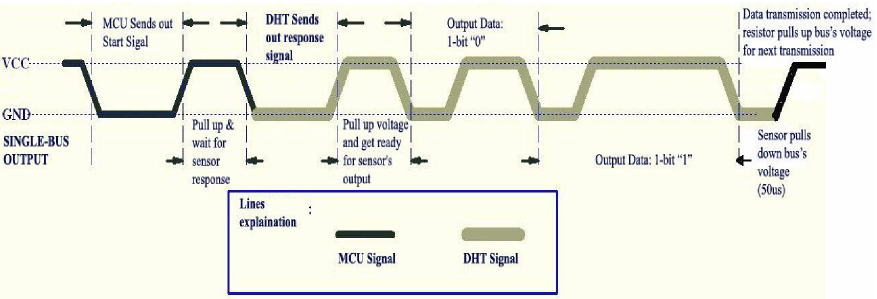
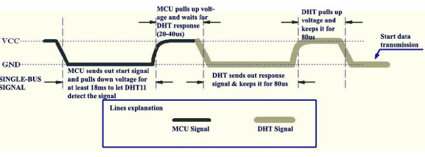
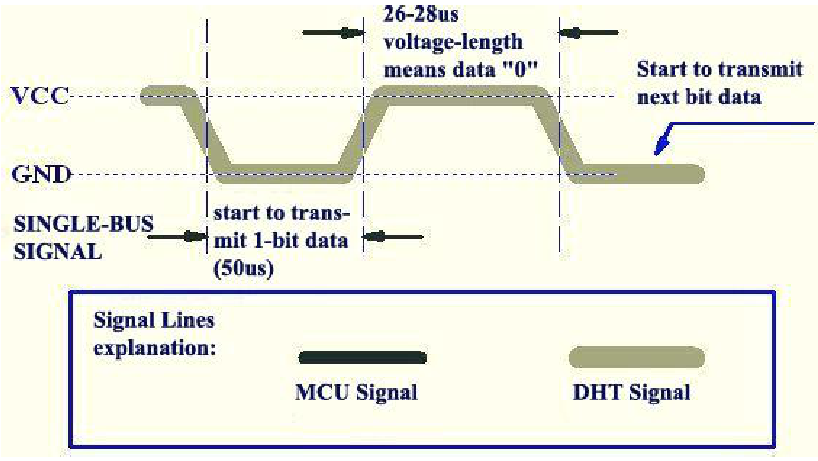

# DHT11 Emulator  Arduino Nano

Proyek ini adalah emulator sensor DHT11 yang dirancang untuk mensimulasikan keluaran sinyal sensor DHT11 secara real-time tanpa memerlukan sensor fisik asli. Tujuan utamanya adalah membantu pengujian firmware, QA, dan validasi perangkat yang berinteraksi dengan sensor suhu dan kelembapan.

## Tujuan Proyek

Pada banyak sistem embedded, pengujian perangkat dengan sensor lingkungan sering kali menghadapi keterbatasan saat ingin mengecek kondisi ekstrem seperti:

- suhu batas dengan nilai tertentu
- kelembapan ekstrem
- kondisi data error atau korup

Sensor fisik tidak selalu mudah dipakai untuk mengecek skenario seperti ini, terutama saat diperlukan pengujian otomatis, cepat, dan berulang. Oleh karena itu, emulator ini dibuat agar perilaku DHT11 dapat diprogram secara fleksibel sesuai kebutuhan pengujian.

## Latar Belakang

- **Memecahkan Masalah Nyata (Real-World Problem Solving):** Menguji skenario ekstrem (seperti suhu overheat 70°C atau suhu di bawah 0°C) pada sensor fisik memang repot dan tidak praktis. Proyek ini membuktikan pemahanan pain point dalam proses hardware testing/QA.
- **Penguasaan Protokol Low-Level:** DHT11 menggunakan protokol custom single-bus dengan timing mikrodetik (μs). Menirukan (emulate) sinyal ini membutuhkan pemahaman mendalam tentang timer/counter, interrupts, serta GPIO bit-banging pada mikrokontroler.
- **Fitur Simulasi yang Luas:** Bisa mensimulasikan kondisi yang sulit didapat dari sensor asli, seperti:
  - Injeksi data suhu/kelembapan ekstrem secara instan.
  - Simulasi kondisi error (seperti checksum error, timeout, atau data korup) untuk menguji keandalan firmware perangkat utama (DUT - Device Under Test).

- **Protokol Komunikasi DHT11:** DHT11 memakai protokol single-bus (one-wire) dan bekerja dengan sinyal master-sensor berbasis timing. Proses komunikasinya dimulai ketika MCU mengirim start signal dengan menarik line data ke LOW selama sekitar 18 µs, lalu melepaskannya. Sensor akan merespons dengan pulse LOW dan HIGH selama sekitar 80 µs, lalu mengirimkan 40 bit data berturut-turut yang terdiri dari:
  - 8 bit RH (Relative Humidity)
  - 8 bit RH decimal
  - 8 bit temperature
  - 8 bit temperature decimal
  - 8 bit checksum

  Setiap bit data dikodekan dalam bentuk pulsa LOW 50 µs diikuti oleh HIGH yang berdurasi 26–28 µs untuk nilai "0" dan sekitar 70 µs untuk nilai "1". Dengan cara ini, mikrokontroler dapat membaca suhu dan kelembapan tanpa membutuhkan antarmuka digital kompleks.

## Protokol DHT11

DHT11 menggunakan protokol komunikasi digital **single-wire** antara master dan sensor. Satu jalur DATA digunakan secara dua arah untuk mengirimkan request dari master dan response/data dari sensor.

Komunikasi DHT11 sangat bergantung pada **timing pulsa dalam satuan mikrodetik (µs)**. Oleh karena itu, emulator DHT11 tidak cukup hanya mengirimkan data yang benar, tetapi juga harus menghasilkan timing yang sesuai dengan karakteristik protokol DHT11.

### Gambaran umum protokol

Ilustrasi berikut menunjukkan keseluruhan sequence komunikasi antara master dan DHT11.



Secara umum komunikasi berlangsung dengan urutan:

```text
Master
  │
  │  1. Start signal
  │──────────────────────>
  │
  │  2. Release DATA
  │──────────────────────>
  │
  │  3. Sensor response
  │<──────────────────────
  │
  │  4. 40-bit data
  │<──────────────────────
  │
  └──────────────────────>
```

### 1. Start Signal

Komunikasi diawali oleh master dengan menarik jalur DATA menjadi **LOW** selama minimal sekitar **18 ms**.

Setelah itu master melepaskan jalur DATA dan mengubahnya menjadi HIGH. DHT11 kemudian mendeteksi kondisi tersebut dan mengambil alih jalur DATA untuk memberikan response.



Secara konseptual sequence-nya:

```text
DATA

HIGH ─────────────────────┐
                          │
                          │
LOW                       └──────────────────
      <---- ≥ 18 ms ---->

                              Master release
                                      │
                                      ▼

HIGH ───────────────────────────────────────
LOW                         ┌───────┐
                            │       │
                            └───────┘
                             ~80 µs
```

Setelah start signal diterima, sensor memberikan response:

```text
LOW  ≈ 80 µs
HIGH ≈ 80 µs
```

Response ini menandakan bahwa sensor siap mengirimkan data.

### 2. Pengiriman Data

Setelah response, DHT11 mengirimkan **40 bit data**, atau **5 byte**.

Format data:

```text
Byte 0 : Humidity Integer
Byte 1 : Humidity Decimal
Byte 2 : Temperature Integer
Byte 3 : Temperature Decimal
Byte 4 : Checksum
```

Sehingga:

```text
40 bit = 5 byte
```

Checksum dihitung dengan:

```text
Checksum =
    Byte0 +
    Byte1 +
    Byte2 +
    Byte3
```

Hanya 8 bit terendah dari hasil penjumlahan yang digunakan sebagai checksum.

Contoh:

```text
Humidity Integer     = 55
Humidity Decimal     = 0
Temperature Integer  = 28
Temperature Decimal  = 0

Checksum = 55 + 0 + 28 + 0
         = 83
```

Maka data yang dikirim:

```text
55  00  28  00  53
```

dalam hexadecimal:

```text
37 00 1C 00 53
```

### 3. Data Bit

Setiap bit data DHT11 dikirim menggunakan sequence LOW kemudian HIGH.



Setiap bit diawali dengan pulsa LOW sekitar **50 µs**. Nilai bit ditentukan oleh durasi HIGH setelah pulsa LOW tersebut.

Secara umum:

```text
Bit 0:

LOW  ≈ 50 µs
HIGH ≈ 26–28 µs


Bit 1:

LOW  ≈ 50 µs
HIGH ≈ 70 µs
```

Dengan demikian, perbedaan antara bit `0` dan bit `1` terutama terletak pada **durasi HIGH**.

```text
BIT 0

       ~50 µs       ~26–28 µs
       ┌───────┐    ┌────┐
HIGH   │       │    │    │
       │       │    │    │
───────┘       └────┘    └────────


BIT 1

       ~50 µs          ~70 µs
       ┌───────┐       ┌──────────┐
HIGH   │       │       │          │
       │       │       │          │
───────┘       └───────┘          └──────
```

> Nilai timing di atas merupakan nilai nominal/umum yang digunakan untuk menjelaskan protokol. Timing aktual dapat bervariasi tergantung sensor, toleransi clock, implementasi library, dan perangkat yang digunakan untuk melakukan capture.

### 4. Urutan 40 Bit

Setelah response, sensor mengirimkan data secara berurutan dari bit paling signifikan (**MSB**) ke bit paling rendah (**LSB**) untuk masing-masing byte.

Contoh:

```text
Humidity Integer
        ↓
01010101

Humidity Decimal
        ↓
00000000

Temperature Integer
        ↓
00011100

Temperature Decimal
        ↓
00000000

Checksum
        ↓
01010011
```

Sehingga keseluruhan frame:

```text
01010101 00000000 00011100 00000000 01010011
```

atau:

```text
55 00 28 00 53
```

### 5. Ringkasan Timing

Secara keseluruhan, komunikasi dapat digambarkan sebagai:

```text
MASTER
  │
  │ LOW ≥ 18 ms
  │
  └───────────────┐
                  │
                  ▼
             RELEASE DATA
                  │
                  ▼
SENSOR            │
  │               │
  │ LOW  ~80 µs   │
  │ HIGH ~80 µs   │
  │               │
  ├── Bit 0 ──────┤
  ├── Bit 1 ──────┤
  ├── Bit 2 ──────┤
  │      ...      │
  └── Bit 39 ─────┘
```

### 6. Relevansi untuk DHT11 Emulator

Pada proyek **DHT11 Emulator**, Arduino Nano harus meniru sequence tersebut sedekat mungkin.

Ada dua hal yang harus dipenuhi:

1. **Data harus benar**

   * 40 bit harus terdiri dari 5 byte.
   * Byte humidity dan temperature harus sesuai nilai yang dikonfigurasi.
   * Checksum harus benar.

2. **Timing harus benar**

   * Start signal harus dikenali.
   * Response sensor harus diberikan pada waktu yang sesuai.
   * Pulsa LOW harus memiliki durasi yang sesuai.
   * Durasi HIGH harus membedakan bit `0` dan `1`.

Karena timing merupakan bagian penting dari protokol, hasil emulasi diverifikasi menggunakan **logic analyzer dan PulseView**.

Capture PulseView digunakan untuk memastikan bahwa waveform yang dihasilkan Arduino Nano memiliki pola:

```text
START
   ↓
SENSOR RESPONSE
   ↓
40 DATA BITS
   ↓
CHECKSUM
```

Dengan cara ini, emulator tidak hanya diuji berdasarkan nilai data yang diterima, tetapi juga berdasarkan **karakteristik sinyal digital dan timing protokol DHT11**.

## Konsep Kerja

Emulator ini bekerja dengan cara:

1. Menyediakan nilai suhu dan kelembapan yang dapat diubah secara manual melalui potensiometer dan switch.
2. Menghasilkan sinyal DHT11 yang menyerupai protokol sensor asli pada pin keluaran tertentu.
3. Menggunakan interrupt dan timer untuk meniru timing yang sangat presisi.
4. Menyediakan tampilan status pada OLED 128x64 agar parameter simulasi mudah dilihat.

Dengan pendekatan ini, perangkat yang diuji (DUT) dapat berinteraksi dengan emulator seolah-olah ia sedang menerima data dari sensor DHT11 sungguhan.

## Fitur Utama

- Emulasi DHT11 berbasis perangkat keras
- Simulasi mode suhu atau kelembapan
- Nilai bisa diubah dari potensiometer
- Simulasi checksum OK/error
- Tampilan parameter di OLED
- Tanpa dependency library eksternal untuk driver utama

## Keunggulan Proyek

- Sangat cocok untuk pengujian firmware dan QA
- Memungkinkan rekayasa skenario error yang sulit dilakukan dengan sensor asli
- Mengajarkan protokol low-level dan timing mikrokontroler secara praktis
- Dapat dikembangkan untuk simulasi sensor lain di masa depan

## Catatan Penting

Proyek ini dirancang untuk kebutuhan testing dan emulasi sensor, bukan untuk menggantikan sensor DHT11 asli dalam lingkungan produksi. Fungsinya lebih kepada validasi perangkat lunak dan otomatisasi pengujian saat kondisi sensor nyata sulit atau tidak praktis dihasilkan.

## Kesimpulan

DHT11 Emulator ini merupakan contoh penerapan pengujian hardware dan protokol embedded secara nyata. Selain bermanfaat untuk validasi alat, proyek ini juga menunjukkan kemampuan dalam memahami timing sinyal, interrupt, dan komunikasi low-level yang sering menjadi tantangan dalam pengembangan sistem berbasis mikrokontroler.

Author
Mulyo Sanyoto (mulyosanyoto@gmail.com)

GitHub:

https://github.com/mulyo

Repository:

https://github.com/mulyo/dht11Emu
