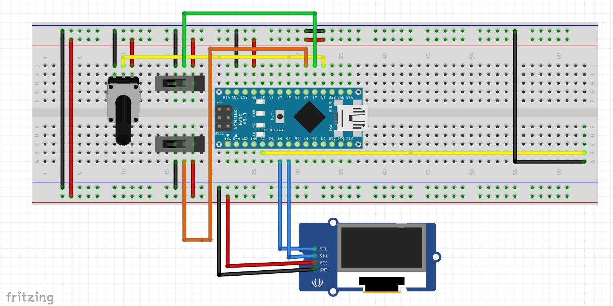
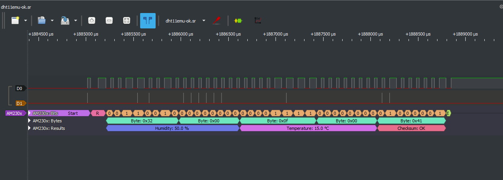

# DHT11 Emulator — Arduino Nano

Emulator sensor **DHT11** berbasis **Arduino Nano (ATmega328P)**.

Proyek ini dibuat untuk mensimulasikan komunikasi digital DHT11 sehingga perangkat yang biasanya membaca sensor DHT11 dapat diuji tanpa menggunakan sensor DHT11 fisik.

Versi pertama menggunakan Arduino Nano sebagai emulator dan dapat diamati menggunakan logic analyzer dengan **PulseView**.

---

## 1. Tujuan

DHT11 menggunakan protokol komunikasi single-wire dengan timing dalam orde mikrodetik. Proyek ini bertujuan untuk:

- mensimulasikan respons sensor DHT11;
- menghasilkan paket data temperatur dan kelembapan;
- menguji perangkat/master yang membaca DHT11;
- melihat timing protokol secara langsung menggunakan logic analyzer;
- menjadi dasar pengembangan emulator DHT11 untuk platform lain.

> **Catatan:** Arduino Nano di sini berperan sebagai **sensor emulator**, bukan sebagai master/pembaca DHT11.

---

## 2. Hardware

Komponen yang diperlukan:

| Komponen | Jumlah | Keterangan |
|---|---:|---|
| Arduino Nano | 1 | ATmega328P, 16 MHz |
| Logic Analyzer | 1 | Untuk capture sinyal DHT11 |
| USB cable | 1 | Pemrograman Arduino Nano |
| Breadboard | 1 | Opsional |
| Kabel jumper | Secukupnya | Koneksi rangkaian |

Untuk pengujian dengan perangkat DHT11 master, hubungkan jalur DATA emulator ke input DATA perangkat tersebut.

---

## 3. Skematik

Skematik rangkaian dibuat menggunakan Fritzing.

<p align="center">
  
</p>

### Koneksi utama

| Arduino Nano | DHT11 Emulator |
|---|---|
| 5V | VCC |
| GND | GND |
| Digital I/O yang digunakan program | DATA |

Jika rangkaian menggunakan resistor pull-up eksternal, pasang resistor sekitar **4.7 kΩ–10 kΩ** antara DATA dan VCC.

> Nomor pin DATA harus mengikuti definisi pada source code emulator.

---

## 4. Protokol DHT11

DHT11 menggunakan komunikasi single-wire. Master terlebih dahulu memberikan start signal, kemudian emulator memberikan response dan mengirimkan 40 bit data.

Format data DHT11 terdiri dari 5 byte:

```text
Byte 0 : Humidity integer
Byte 1 : Humidity decimal
Byte 2 : Temperature integer
Byte 3 : Temperature decimal
Byte 4 : Checksum
```

Checksum:

```text
checksum = byte0 + byte1 + byte2 + byte3
```

yang dibandingkan pada 8 bit terakhir.

### Timing dasar

Secara umum sequence komunikasi adalah:

```text
MASTER
  |
  |---- LOW sekitar 18 ms ----|
  |---- HIGH ------------------|
  |
  v
SENSOR / EMULATOR
  |
  |-- LOW  ~80 us
  |-- HIGH ~80 us
  |
  |-- DATA BIT 0
  |-- DATA BIT 1
  |-- DATA BIT 2
  |      ...
  |-- DATA BIT 39
```

Setiap bit data diawali pulsa LOW sekitar 50 µs.

Perbedaan nilai `0` dan `1` terutama ditentukan oleh durasi HIGH:

```text
Bit 0 : HIGH lebih pendek
Bit 1 : HIGH lebih panjang
```

Nilai aktual dapat sedikit berbeda karena toleransi clock, implementasi software, dan perangkat yang digunakan untuk capture.

---

## 5. Logic Analyzer dan PulseView

Untuk memverifikasi emulator, gunakan logic analyzer yang terhubung ke jalur DATA.

Contoh hasil capture:

<p align="center">
  
</p>

Capture ini digunakan untuk memeriksa:

1. Start signal dari master.
2. Response dari emulator.
3. Pulsa LOW/HIGH.
4. Timing setiap bit.
5. Total 40 bit data.
6. Pola `0` dan `1`.
7. Checksum.

### Bentuk data

Secara konseptual hasil capture akan terlihat seperti:

```text
START
│
├── Response
│
├── Bit 39
├── Bit 38
├── Bit 37
│      ...
├── Bit 2
├── Bit 1
└── Bit 0
```

Untuk debugging timing, lakukan zoom pada bagian data bit sehingga durasi pulsa dapat diukur dalam mikrodetik.

---

## 6. Struktur Repository

Struktur yang disarankan:

```text
dht11Emu/
│
├── README.md
├── dht11Emu.ino
├── fritzing.png
└── pulseview.png
```

Jika nama file sketch berbeda, gunakan nama file `.ino` yang tersedia di repository.

---

## 7. Instalasi Arduino IDE

### 7.1 Install Arduino IDE

Download dan install Arduino IDE dari:

https://www.arduino.cc/en/software

Kemudian jalankan Arduino IDE.

### 7.2 Buka source code

Clone repository:

```bash
git clone https://github.com/mulyo/dht11Emu.git
```

Masuk ke directory:

```bash
cd dht11Emu
```

Kemudian buka file `.ino` menggunakan Arduino IDE.

Alternatifnya, download repository sebagai ZIP dari GitHub.

---

## 8. Konfigurasi Arduino Nano

Di Arduino IDE pilih:

```text
Tools
 ├── Board
 │    └── Arduino AVR Boards
 │         └── Arduino Nano
 │
 ├── Processor
 │    └── ATmega328P
 │
 └── Port
      └── COMx
```

### Nano clone / bootloader lama

Jika proses upload gagal pada Nano clone, coba:

```text
Tools
→ Processor
→ ATmega328P (Old Bootloader)
```

Kemudian pilih kembali COM port yang sesuai.

---

## 9. Compile

Sebelum upload, lakukan compile terlebih dahulu:

```text
Sketch
→ Verify/Compile
```

atau tekan:

```text
Ctrl + R
```

Jika berhasil, Arduino IDE akan menampilkan:

```text
Done compiling.
```

Pastikan tidak ada error compilation.

---

## 10. Upload ke Arduino Nano

Hubungkan Arduino Nano melalui USB.

Pilih:

```text
Tools
→ Port
→ COMx
```

Kemudian:

```text
Sketch
→ Upload
```

atau:

```text
Ctrl + U
```

Jika berhasil akan muncul:

```text
Done uploading.
```

---

## 11. Pengujian Dasar

Setelah program berhasil di-upload:

1. Hubungkan Nano ke USB.
2. Pastikan wiring DATA benar.
3. Hubungkan logic analyzer ke DATA dan GND.
4. Jalankan PulseView.
5. Pilih channel logic analyzer yang terhubung ke DATA.
6. Atur sample rate yang cukup tinggi untuk melihat pulsa dalam orde mikrodetik.
7. Jalankan perangkat/master yang melakukan request DHT11.
8. Mulai capture.
9. Periksa response dan 40 bit data.

### Hal yang harus diperiksa

```text
[ ] Master mengirim start signal
[ ] Emulator mendeteksi request
[ ] Emulator memberikan response
[ ] Terdapat 40 bit data
[ ] Timing LOW sesuai
[ ] Timing HIGH untuk bit 0 dan 1 berbeda
[ ] Checksum benar
[ ] Data temperatur sesuai konfigurasi emulator
[ ] Data humidity sesuai konfigurasi emulator
```

---

## 12. Pengujian dengan Perangkat DHT11 Reader

Setelah timing diverifikasi dengan PulseView, emulator dapat dihubungkan ke perangkat yang biasanya menggunakan DHT11.

Contoh alur:

```text
        DHT11 Reader
             |
             | DATA
             |
             v
     +----------------+
     | Arduino Nano   |
     | DHT11 Emulator |
     +----------------+
             |
             |
         Logic Analyzer
             |
             v
          PulseView
```

Dengan konfigurasi ini, logic analyzer dapat digunakan bersamaan dengan reader untuk melihat komunikasi aktual.

---

## 13. Troubleshooting

### Tidak ada response

Periksa:

- GND harus common.
- Jalur DATA benar.
- Pin DATA pada source code sesuai dengan wiring.
- Master benar-benar mengirim start signal.
- Logic analyzer terhubung ke DATA yang benar.

### Data terbaca tetapi salah

Periksa:

- urutan 40 bit;
- byte humidity;
- byte temperature;
- checksum;
- timing HIGH untuk bit `0`;
- timing HIGH untuk bit `1`.

### Upload gagal

Coba:

```text
Tools
→ Board
→ Arduino Nano
→ Processor
→ ATmega328P (Old Bootloader)
```

Kemudian periksa kembali COM port.

### PulseView tidak menunjukkan bentuk gelombang yang jelas

Periksa:

- sample rate logic analyzer;
- channel yang digunakan;
- koneksi GND;
- trigger/capture configuration;
- lakukan zoom pada bagian pulsa data.

---

## 14. Pengembangan Selanjutnya

Versi pertama menggunakan Arduino Nano sebagai platform emulator.

Pengembangan berikutnya dapat mencakup:

- konfigurasi temperatur melalui Serial;
- konfigurasi humidity melalui Serial;
- beberapa profil sensor;
- simulasi sensor rusak;
- simulasi checksum error;
- simulasi timing error;
- simulasi timeout;
- emulator berbasis ESP32;
- emulator berbasis STM32;
- pengujian otomatis terhadap berbagai DHT11 reader;
- automated protocol test menggunakan logic analyzer.

---

## 15. Versi

### Version 1 — Arduino Nano

Status:

**Prototype / Experimental**

Platform:

```text
Arduino Nano
ATmega328P
16 MHz
```

Fokus versi pertama:

```text
DHT11 protocol emulation
        +
Logic analyzer verification
        +
PulseView analysis
```

---

## 16. License

Tambahkan file `LICENSE` ke repository jika proyek akan didistribusikan sebagai open-source.

---

## Author

**Mulyo Sanyoto** (mulyosanyoto@gmail.com)

GitHub:

https://github.com/mulyo

Repository:

https://github.com/mulyo/dht11Emu

